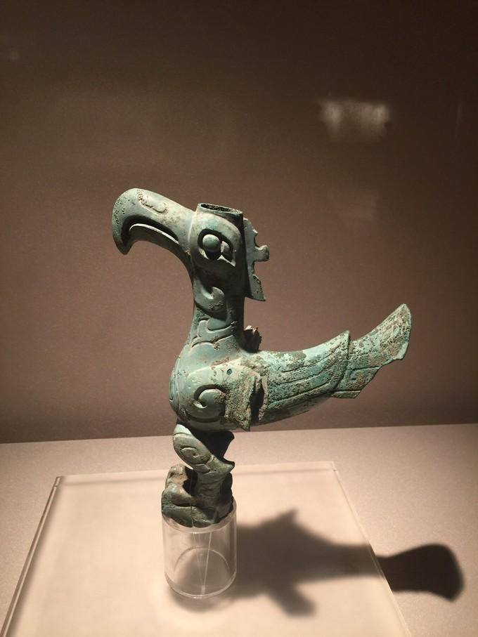

# Luke's Notes

Welcome to my space!

[My GitHub Profile](https://github.com/icecoobe)

## 能处理什么呢？ / What Can Be Handled?

这个笔记库涵盖了多个技术领域的知识和经验总结，主要包括：

This notes repository covers knowledge and experience across multiple technical domains, including:

### 📚 主要内容 / Main Topics

- **Linux 系统 / Linux Systems**
    - 常用工具和命令 / Common tools and commands
    - Shell 脚本最佳实践 / Shell scripting best practices
    - 系统管理和故障排查 / System administration and troubleshooting
    - 文件链接和管理 / File linking and management

- **C/C++ 编程 / C/C++ Programming**
    - C 和 C++ 语言基础 / C and C++ language fundamentals
    - 面向对象编程 (虚函数、RTTI、多态) / Object-oriented programming (virtual functions, RTTI, polymorphism)
    - 设计模式 / Design patterns
    - 编译和交叉编译 / Building and cross-compilation
    - GoogleTest 测试框架 / GoogleTest testing framework
    - 数据编码 / Data encoding

- **算法 / Algorithms**
    - 算法概述和学习资源 / Algorithm overview and learning resources
    - 常见算法模式 / Common algorithm patterns

- **Qt 框架 / Qt Framework**
    - Qt 开发基础 / Qt development basics
    - 自定义控件 / Custom widgets
    - UI 设计 / UI design
    - 常见问题解答 / Frequently asked questions

- **其他主题 / Miscellaneous Topics**
    - 技术思考和讨论 / Technical thoughts and discussions
    - 收藏和参考资料 / Collections and references
    - 数字化转型 / Digital transformation

### 🎯 使用场景 / Use Cases

- **学习参考** / Learning reference: 作为技术学习和复习的知识库
- **问题解决** / Problem solving: 快速查找常见问题的解决方案
- **经验总结** / Experience summary: 记录和分享开发经验
- **知识管理** / Knowledge management: 替代 Evernote 的个人知识库

## Table of Contents

- [TODO](TODO.md)
- [Reference](reference.md)

## My Workshops and Projects

### OS

- My practices on OS dev [oslab](https://github.com/icecoobe/oslab)
- [Linux From Scratch - LFS](https://www.linuxfromscratch.org/) finished LFS Systemd `v7.8`
- [Archived - Linux.cn TranslateProject](https://github.com/LCTT/TranslateProject)
- My favorite distribution [Arch Linux](https://archlinux.org/)

### Tools and Utilities

- [nBleTool - Cross-platform BLE Dev Tool, in Qt5](https://github.com/icecoobe/nbletool)
- [CyBleToolWpf - A Bluetooth LE tool for Windows](https://github.com/icecoobe/CyBleToolWpf) 
- [SBC Windows - to support CMake!!](https://github.com/icecoobe/sbc-windows)
- [ADPCM Decoding](https://github.com/icecoobe/adpcm-decoder)
- [Windows Driver Development](https://github.com/icecoobe/WinDriver)
- [Material Design Demo in WPF](https://github.com/icecoobe/MaterialDesignDemo)
- [Qt Plugin Sample](https://github.com/icecoobe/Qt-plugin-test)
- [My Visual Studio Code Extension](https://github.com/icecoobe/rbp-vsc-ext-viz)

!!! abstract

    铜鸟一觉醒来，时间已经飞行了三千年，太阳还是那个太阳。 ---- 三星堆博物馆

---
